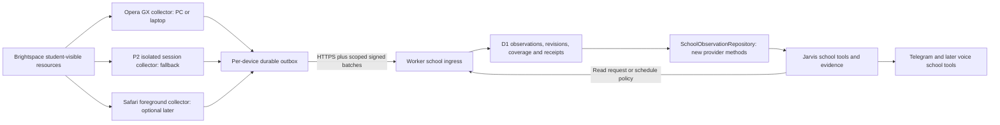

# D2L access: a session collector, with honest coverage

Design research, 2026-09-23. Author: Codex (GPT-6; reasoning-effort setting not exposed).
Repository inspected at freshly fetched `origin/main` = `a666097ffe6e0b2c99dc83ce29fc43efacdf7f4d`.
No school-host requests, login, credentials, production access or implementation in this research.

## Recommendation

**UNVERIFIED — proposed architecture, conditional on E1–E4 below:** make a small Chromium MV3 extension in Sid's existing Opera GX profiles on **both Windows machines** the primary collector. Read the published Brightspace REST resources using the browser's existing student session; keep school credentials in that browser; push typed, provenance-bearing observations through a **school-only Ed25519 credential**, using Jarvis's existing signed-request protocol. Keep the DeepSeek-owned P2 effort as the **session-first PC fallback and coverage adapter**, preferring the same APIs before HTML. Add Safari foreground collection only after the Windows path works and its marginal benefit is measured. This is the best feasible direction under the stated constraints, not a proven deployment: no available client can promise new overnight data while every usable browser is asleep, or promise never to require another login. Cloud D1 must remain usable with the last observed data and its age. A school-approved, narrowly scoped OAuth integration would be the better unattended long-term transport **if access ever becomes available**; it is currently unavailable and is not a setup task for Sid. Evidence: [D2L session behavior](https://community.d2l.com/brightspace/discussion/473/what-is-the-proper-format-for-making-an-ajax-put-request), [Chromium networking](https://developer.chrome.com/docs/extensions/develop/concepts/network-requests), [iOS lifecycle](https://developer.apple.com/documentation/safariservices/optimizing-your-web-extension-for-safari), [registered OAuth](https://docs.valence.desire2learn.com/basic/oauth2.html).

## How to read the evidence

**VERIFIED** means the cited source establishes the stated, bounded claim: **repo** is code inspected at the revision above; **docs** is public documentation; **reported** is an explicit owner statement, not a new device or school test. **UNVERIFIED** means a hypothesis, forecast, recommendation or untested tenant/device behavior. A documented endpoint is not proof that Sid's role can call it. A community report proves that someone reported the behavior, not a vendor compatibility guarantee. All proposed behavior, scores, estimates, diagrams and acceptance criteria below are **UNVERIFIED until implemented and tested**. The experiments are instructions for a later authorized session; none ran here.

### Premises checked before choosing a route

| Premise | Finding and evidence |
|---|---|
| School is urgently behind | **VERIFIED — reported:** the task supplies the grade-12 context and attendance/assignment counts. **UNVERIFIED:** those counts against school records. They are motivation, not observations to insert into D1. No medical or attendance record was accessed. |
| No iCal and no useful notification email | **VERIFIED — repo/owner record:** [FACTS, school rows](../FACTS.md) records no calendar tool/feed, and notifications containing neither assignment name nor due date despite all options enabled. Do not ask for either again. This does **not** establish whether an authenticated calendar REST route returns anything (E3). |
| Classroom is impossible | **VERIFIED — repo/owner record:** the M365 school account cannot obtain the required Google credentials; [FACTS](../FACTS.md) closes this route for this deployment. This is a local constraint, not a universal claim about all school accounts. |
| No registered Brightspace app key | **VERIFIED — reported:** explicit in this task, previously missing from FACTS; added there by this PR. **VERIFIED — docs:** [OAuth registration](https://docs.valence.desire2learn.com/basic/oauth2.html) uses Manage Extensibility. No student self-registration shortcut was established. |
| School SSO and MFA requirements | **VERIFIED — repo/owner record:** [FACTS](../FACTS.md) says **no MFA**, password plus a click, observed 2026-09-21; a stale session has needed a second attempt. **UNVERIFIED:** exact SSO redirects, conditional-access rules, absolute/idle lifetime and whether this remains true. Do not infer a particular identity provider merely from M365, or assume future MFA is solved by retaining a password. |
| PC, laptop, iPhone; PC off overnight | **VERIFIED — repo/owner record:** [AGENTS](../../AGENTS.md) and [FACTS](../FACTS.md). Daytime PC availability is useful, but browser-running availability is a separate **UNVERIFIED** fact. Opera GX on both Windows devices is **VERIFIED — reported** in this task and added to FACTS. Installed versions and iPhone browsing habits are **UNVERIFIED** (E4/E7). |
| Only the PC can be logged in | **UNVERIFIED and unsupported:** the P2 brief and STATE overstate this. The fleet includes two other browser-capable devices. Which profiles are actually logged in is untested. This PR corrects the exclusivity claim without reallocating the builder's work. |
| The pipeline cannot receive useful data | **VERIFIED — repo:** this is [STATE's school verdict](../STATE.md), with the unusable configured inputs explained. **UNVERIFIED:** today's live database state; it was deliberately not queried. |
| Page reader is source-agnostic | **Only partly true — VERIFIED, repo:** `ClassroomSubmissionPageReader` is injectable, but its result is `ClassroomSubmissionPage`, containing `RawSchoolSubmissionObservation` and Classroom submission states. Storage and readers further enforce Classroom provenance. See the concrete gaps below. |
| Signed push already supports school observations | **False — VERIFIED, repo:** [sync-routes.ts](../../apps/cloud-gateway/src/http/sync-routes.ts) accepts four named sync/distillation/projection paths, not a school ingest route. It supplies a reusable authentication pattern, not this feature. |
| DPAPI prevents any other process under Sid from opening a sealed session | **False — VERIFIED by code plus platform docs:** [dpapi.py](../../apps/local-agent/jarvis_local/crypto/dpapi.py) uses a public constant as optional entropy. [Microsoft](https://learn.microsoft.com/en-us/windows/win32/api/dpapi/nf-dpapi-cryptprotectdata) binds normal DPAPI decryption to the user, usually the machine, and the same entropy. A process running as Sid can supply that constant. The source comment promising process isolation is wrong; no DPAPI code was executed or changed. |
| Safari development requires buying a Mac | **False as a universal claim — VERIFIED, docs:** Apple's [web packager](https://developer.apple.com/documentation/safariservices/packaging-and-distributing-safari-web-extensions-with-app-store-connect) packages from a browser without Mac/Xcode, but requires Apple Developer Program enrollment. Availability of an existing account and acceptable distribution is **UNVERIFIED**. No signup or spending here. |

**VERIFIED — repo:** [CODE-VS-JUDGMENT](../CODE-VS-JUDGMENT.md) assigns interpretation and action choices to Jarvis. The roadmap's email-specific school exit test contradicts the recorded input limitation. **UNVERIFIED — recommended replacement criterion:** an actual D2L assignment or change appears with provenance in Jarvis after a collector runs, without Sid forwarding or transcribing it. The carrier notes in this PR expose that discrepancy; they do not claim the new route is accepted or built.

## What the browser can actually do

### Session cookies and CSRF

**VERIFIED — community evidence, not a general support contract:** D2L's [discussion 473](https://community.d2l.com/brightspace/discussion/473/what-is-the-proper-format-for-making-an-ajax-put-request) documents in-page API GETs succeeding using the logged-in session. It distinguishes non-GET requests needing `X-Csrf-Token`; it identifies `/d2l/lp/auth/xsrf-tokens` as undocumented and unsupported. Examples also use `localStorage['XSRF.Token']`. This establishes a credible read-only session route, **not student permissions on this board**. **UNVERIFIED:** E1/E2 must establish that separately. Start a same-origin GET with `credentials: 'same-origin'`, `Accept: application/json` and no invented token header. Do not implement token minting, POST/PUT, or an undocumented XSRF dependency merely because a sample exists. If a GET fails, compare the native page's successful GET and its header **names** before diagnosing CSRF. A 403 alone cannot distinguish authorization, session loss and request-context restrictions.

**VERIFIED — docs:** D2L's [supported external application flow](https://docs.valence.desire2learn.com/basic/firstlist.html) requires app registration; the [calling conventions](https://docs.valence.desire2learn.com/basic/apicall.html) use `Authorization: Bearer …`. **UNVERIFIED:** session-authenticated external extensions have no equivalent stability promise in the evidence reviewed. Treat browser-session authentication as a replaceable adapter, even when it calls documented resources. Never substitute a copied Pulse client identity for Jarvis registration.

### Opera GX, without a D2L tab

**VERIFIED — Chromium docs:** a [service worker can fetch cross-origin with host permissions](https://developer.chrome.com/docs/extensions/develop/concepts/network-requests); a content script remains subject to its page's origin rules. Fetch from the worker with `credentials: 'include'`. [Chrome's cookie rules](https://developer.chrome.com/docs/extensions/develop/concepts/storage-and-cookies) treat permitted-host extension network requests as same-site, allowing even Strict cookies, with a documented third-party-cookie-blocking caveat. Permission to send a request is not permission from the server to accept it. The `cookies` permission is unnecessary for ordinary automatic cookie sending; do not request it just to copy secrets.

**VERIFIED — Opera docs:** Opera is Chromium-based, [supports CRX extensions](https://help.opera.com/en/extensions/) and [lists alarms/cookies APIs](https://help.opera.com/en/extensions/apis/); it describes [MV3 as its extension direction](https://blogs.opera.com/news/2025/09/mv2-extensions-opera/). **UNVERIFIED:** the installed GX builds, settings and this board's request checks permit the exact tabless fetch. No school tab is intrinsically required by the Chromium architecture, but only E4 proves this combination. Host permission also covers the whole origin: a `/d2l/api/*` spelling does not narrow the network permission to those paths. Enforce the route and method allowlist in the collector as well.

**VERIFIED — Chromium docs:** [workers can stop after 30 seconds idle, a long operation, or a slow fetch](https://developer.chrome.com/docs/extensions/develop/concepts/service-workers/lifecycle). [Alarms do not wake a sleeping device](https://developer.chrome.com/docs/extensions/reference/api/alarms); missed repeating alarms coalesce. Alarm persistence differs across versions/browsers, so check/recreate the intended alarm on startup and worker initialization. **UNVERIFIED — design implication:** persist scan/outbox progress after each page, use bounded requests, and make alarm events resume work. Browser fully closed, machine asleep/off and session expired are different cases; none is solved by `setInterval`, an offscreen document or a claimed always-running worker. Do not change GX resource-limit/background settings to make a test look green.

### Safari on the iPhone

**VERIFIED — Apple docs:** [iOS extension backgrounds must be nonpersistent, or MV3 service workers](https://developer.apple.com/documentation/safariservices/optimizing-your-web-extension-for-safari); Apple recommends alarms and persisted state. [Website permission](https://developer.apple.com/documentation/safariservices/managing-safari-web-extension-permissions) is user-controlled. [Compatibility differs](https://developer.apple.com/documentation/safariservices/assessing-your-safari-web-extension-s-browser-compatibility): for example, `identity` is unsupported and `webRequest` is unsupported on iOS. These are not evidence of an overnight execution guarantee.

**UNVERIFIED:** Safari background fetch attaching this student's session cookies, and alarms executing while Safari is suspended, are untested. Do **not** transplant Chrome's cookie exception to iOS. The defensible phone plan is a content script reading same-origin while Sid visits D2L **in Safari**, then handing the result to the extension for a signed push. E7 tests foreground and background separately. Opening Pulse, Telegram's in-app browser or another iPhone browser must not be advertised as running a Safari extension. A phone-primary design adds a new browsing habit unless Sid already uses that surface; that is the wrong dependency for someone who needs less homework.

## API inventory and coverage limits

**VERIFIED — docs, UNVERIFIED on Sid's tenant for every row:** the following are published GET routes, not promises of access. Prefix course resources with `/d2l/api/le/<LE>/<courseId>` and platform resources with `/d2l/api/lp/<LP>`. Course IDs come from the student's own enrollment results, never guessed or enumerated. Use the **intersection of host-supported and adapter-tested versions**, separately for LP and LE. [Version discovery](https://docs.valence.desire2learn.com/res/apiprop.html) provides `/d2l/api/versions/` and `/d2l/api/<product>/versions/`; [version guidance](https://docs.valence.desire2learn.com/basic/version.html) describes negotiation. The September 2026 references list LP **1.49+** and LE **1.82+** for the baseline routes below; these are reference support ranges, not the school's measured versions or proof of when the functionality was originally invented. Do not copy obsolete 1.0/1.26 examples or auto-upgrade to an untested maximum.

| Data | GET route | What is established; what still needs testing |
|---|---|---|
| Identity | LP `/users/whoami` | Current-user identity, LP 1.49+. Keep only the stable user binding needed locally/server-side, not account email. [Users](https://docs.valence.desire2learn.com/res/user.html). E1. |
| Courses | LP `/enrollments/myenrollments/` | Own enrollments, bookmarks, access/activity metadata; LP 1.49+. Complete pagination; do not equate pinned homepage courses with all courses. [Enrollments](https://docs.valence.desire2learn.com/res/enroll.html). E3. |
| Assignments and due dates | LE `/dropbox/folders/` and `/dropbox/folders/<folderId>` | `DropboxFolder` has nullable `DueDate`, separate availability dates, submission/completion type and grade link. LE 1.82+. A calendar date can instead be an availability date. [Dropboxes](https://docs.valence.desire2learn.com/res/dropbox.html). E3/E6. |
| Own submissions and published feedback | LE `/dropbox/folders/<folderId>/submissions/mysubmissions/` | Current-user submissions and published feedback, LE 1.82+. Test group/offline/text variants; never call the all-users submissions route. [Dropboxes](https://docs.valence.desire2learn.com/res/dropbox.html). E3/E6. |
| Individual deadline exceptions | LE `/dropbox/folders/<folderId>/specialaccess/<ownUserId>` | Published route, LE 1.82+. Student access and whether ordinary folder data already reflects the exception remain unverified. Preserve conflicting evidence. [Dropboxes](https://docs.valence.desire2learn.com/res/dropbox.html). E6. |
| Item grades | LE `/grades/values/myGradeValues/` | Own `GradeValue` list, LE 1.82+; permission can refuse it; 404 may mean no grades. Preserve numeric/text type, denominator and released/visible evidence. [Grades](https://docs.valence.desire2learn.com/res/grade.html). E3/E6. |
| Final grades | `/d2l/api/le/<LE>/grades/final/values/myGradeValues/?orgUnitIdsCSV=<courseIds>` | Own final grades across requested courses, at most 100 IDs; LE 1.82+. Do not invent a final grade when withheld. [Grades](https://docs.valence.desire2learn.com/res/grade.html). E3. |
| Calendar | LE `/calendar/events/`; alternatively `/d2l/api/le/<LE>/calendar/events/myEvents/?orgUnitIdsCSV=<ids>&startDateTime=<UTC>&endDateTime=<UTC>` | Per-course events or a bounded multi-course window; LE 1.82+. The multi-course route requires the IDs and both times. No feed does not prove REST access, nor does an empty calendar prove no assignments. [Calendar](https://docs.valence.desire2learn.com/res/calendar.html). E3. |
| Quizzes | LE `/quizzes/`, `/quizzes/<quizId>`; `/quizzes/<quizId>/attempts/?userId=<ownUserId>` | Quiz metadata and attempt resources, LE 1.82+, subject to permissions. The attempts endpoint is **not documented as an unconditional student self-service route**. Record a refusal; never omit the own-user restriction, start an attempt or request questions/answers. [Quizzes](https://docs.valence.desire2learn.com/res/quiz.html). E3/E6. |
| Content | LE `/content/toc`, `/content/topics/<topicId>`, `/content/topics/<topicId>/file` | Structure, topic metadata and files, LE 1.82+. Respect normal visibility; no `ignoreDateRestrictions` or impersonation parameter. Metadata is not full file text. Binary downloads/text extraction are separately requested coverage. [Content](https://docs.valence.desire2learn.com/res/content.html). E3/E6. |
| Announcements | LE `/news/`, `/news/<newsItemId>` | Course news and bodies, LE 1.82+, subject to visibility. Announcements may contain otherwise-unstructured homework. [News](https://docs.valence.desire2learn.com/res/news.html). E3/E6. |

**UNVERIFIED — semantic design:** retain *all* visible enrolled-course items, including undated work. Preserve null, zero, hidden/withheld, not attempted, forbidden and endpoint unavailable as different observations. No submission returned does not prove unfinished work: a teacher may accept paper, a group submission may be elsewhere, or an extension may change the due date. Grade zero does not mean missing; ungraded does not mean unsubmitted. Content, announcements, attachments and linked external tools may contain tasks outside dropbox. E6 measures the gaps, and Jarvis interprets them with source references. Mechanical ID joins may use explicit API links; fuzzy matching and conflicting due-date resolution belong to Jarvis.

## Route comparison

**UNVERIFIED — engineering judgments, not benchmark results.** Scores run 0 (cannot meet the criterion) to 5 (best fit); higher effort score means easier to build/maintain. `Sid` means little recurring work after setup, `off` means fresh collection with the **home PC off**, `data` means useful structured coverage, `robust` includes UI/auth/lifecycle, `secure` means limited retained authority, `terms` is relative policy exposure, and `fit` includes CODE-VS-JUDGMENT. Tenant acceptable-use remains unverified for every unofficial integration. Scores for the proposed extension assume E1–E4 succeed; a failure removes that route rather than being averaged away. No weighted total can compensate for unavailable authentication.

| Route | Sid | off | data | robust | secure | terms | effort | fit | Assessment |
|---|---:|---:|---:|---:|---:|---:|---:|---:|---|
| 1. MV3 session/API, PC + laptop | 4 | 3 | 4 | 3 | 4 | 2 | 3 | 4 | Recommended primary; laptop must be awake, GX running and session valid. |
| 2. Userscript in an open tab | 2 | 2 | 4 | 2 | 3 | 2 | 5 | 3 | Cheap feasibility probe/temporary bridge; tab dependence becomes Sid's work. |
| 3. iPhone Safari extension | 2 | 4 | 4 | 2 | 4 | 2 | 2 | 4 | Good opportunistic contributor; uncertain background, new distribution and Safari-use dependency. |
| 4a. PC browser, sealed session, API first | 3 | 0 | 4 | 3 | 3 | 2 | 3 | 4 | Useful scheduled daytime fallback, independent of GX being open; own login/session still needed. |
| 4b. PC browser, stored password + HTML | 3 | 0 | 3 | 1 | 1 | 1 | 2 | 3 | Larger credential exposure and fragile login/parser; do not make this the first commitment. |
| 5. Pulse UI as Jarvis input | 1 | 5 | 1 | 1 | 3 | 3 | 1 | 1 | Supported app for Sid, no established automatic export to Jarvis. |
| 5b. Reuse Pulse tokens/private flow | 0 | 0 | 0 | 0 | 1 | 0 | 1 | 1 | No verified legitimate, stable integration contract; reject as a foundation. |
| 6. Windows extension + P2 fallback; phone later | 4 | 3 | 4 | 4 | 3 | 2 | 2 | 4 | Chosen phased hybrid; fallback only for measured gaps, not two simultaneous full crawlers. |
| 7. Registered student-context OAuth in cloud | 5 | 5 | 4 | 5 | 4 | 5 | 3 | 5 | Best conditional end state, **unavailable now**. No new app-key homework. |
| 8. Data Hub / LTI / institution export | 4 | 5 | 3 | 4 | 2 | 5 | 1 | 3 | Institution-controlled; no verified student route. Avoid broad institution datasets. |
| 9. Manual share/export/phone Shortcut | 1 | 4 | 2 | 2 | 4 | 3 | 4 | 3 | Recovery input only, cannot fulfill automatic ingestion. |
| 10. Cloud-hosted browser with copied cookies | 3 | 5 | 4 | 2 | 1 | 1 | 1 | 3 | Adds cloud session authority, cost and SSO-location risk; reject under current constraints. |

**VERIFIED — userscript docs:** [Tampermonkey](https://www.tampermonkey.net/documentation.php?locale=en) supports URL matching, sandbox choices, storage and privileged cross-origin requests. **UNVERIFIED — assessment:** a script triggered by a D2L page is easy to prototype, but it adds a manager/update trust chain, page lifetime and signing-key isolation concerns. Choose native same-origin GETs for school data, not a manager-specific cookie workaround. GM storage is not a vault. Do not persist a Jarvis-wide bearer token in page localStorage. The same school-only ingest contract would still be needed.

**VERIFIED — automation docs:** [Playwright authentication](https://playwright.dev/docs/auth) supports reuse of authenticated state and warns that state files permit impersonation. Session storage requires separate handling. [WebView2](https://learn.microsoft.com/en-us/microsoft-edge/webview2/concepts/user-data-folder) keeps cookies and other state in its user-data folder; it is not simply Opera's existing login. **UNVERIFIED — assessment:** prefer Playwright's isolated browser context for an API-first P2 implementation if E8 justifies it; WebView2 is an option for an attended Windows login shell, not inherently a better headless engine. Do not attach to or copy Sid's main GX profile. Seal the state in memory before writing; encrypting a cookie JSON file does not also seal a persistent browser profile, trace, screenshot or download. Password automation may work with today's no-MFA report, but its selectors, SSO steps, session lifetime and response to future MFA are unproven. A stored password does not solve a future MFA challenge.

**VERIFIED — D2L docs:** [session measurement guidance](https://community.d2l.com/brightspace/kb/articles/17218-what-is-the-new-system-access-metric-and-how-do-i-use-it) distinguishes browser sessions, configured inactivity timeout and administrator-ended sessions from mobile app access. **UNVERIFIED:** a particular cookie expiry or mobile token duration is not this board's effective SSO lifetime. No fixed number of login-free days is justified here.

**VERIFIED — Pulse docs:** [Pulse uses OAuth2](https://community.d2l.com/brightspace/kb/articles/4603-sign-into-brightspace-pulse); [D2L lists Pulse's own registered applications](https://community.d2l.com/brightspace/kb/articles/28762-extensibility-apps-in-the-new-content-experience); [the app displays assignments, grades, content and announcements](https://community.d2l.com/brightspace/kb/articles/16502-about-brightspace-pulse). **UNVERIFIED:** no documented grant delegating Pulse's tokens to Jarvis, machine export, stable public Pulse API or reusable refresh contract was found in those sources. That is a research limit, not proof one can never exist. Token interception, extracting app secrets, spoofing a Pulse callback/client, notification harvesting and treating a remembered mobile login as a general API license are rejected. The legitimate future path is Jarvis's own approved OAuth registration, not borrowing Pulse's.

**VERIFIED — other official routes:** [Data Hub](https://community.d2l.com/brightspace/kb/articles/4509-set-up-data-hub) needs organization-level permissions; [LTI registration](https://community.d2l.com/brightspace/kb/articles/23730-about-lti-1-3-launch-and-authentication) needs an administrator. **UNVERIFIED — assessment:** neither bypasses this student's app-registration constraint or promises a complete student export. An existing institution export could become another observation source if one is actually supplied. A bookmarklet/Shortcut/manual export remains useful only for recovery; a PWA on Jarvis's origin does not inherit D2L cookies or read access. Cloud browser hosting would require a new service and credential boundary, both unjustified before the local session experiments. No contact, provisioning or purchase is proposed as a prerequisite to the Windows proof.

## Chosen architecture

**UNVERIFIED — design to build after the experiments:**



### Collector and scheduling contract

**UNVERIFIED — design:** one shared typed API adapter, with different execution hosts. Enrollment binds a collector to one owner, one configured school origin and one observed student identity. Each run attempts an identity GET and returns its actual outcome; it does not hide work behind `D2LIfLoggedIn`. A different signed-in account cannot silently replace Sid's source. Browser cookies never enter the outbox or the cloud. Start with only the exact school and gateway origins plus `alarms` and `storage`; add a narrowly matched content script for the proven foreground fallback. No all-sites access, cookies API, debugger, browser history, native messaging or remote code. A school response supplies IDs/data, never executable commands or arbitrary fetch destinations.

**UNVERIFIED — design:** Jarvis chooses read scope, requested next-read time and notification policy through visible tools. Alarms are the extension's wake-up mechanism; they execute the recorded schedule and transport pending requests, not a hard-coded school-hours judgment. A transport retry ceiling, byte budget and provider `Retry-After` are mechanical constraints, reported with a continuation. Never silently cap the school inventory at the first N items. Each page persists its cursor and coverage. Worker termination, browser restart or network loss resumes the page; a repeated cursor becomes a named failure. [D2L's rate-limit headers](https://docs.valence.desire2learn.com/basic/apicall.html) are **VERIFIED — docs**. Whether session calls get the same accounting is **UNVERIFIED**.

**UNVERIFIED — design:** cloud maintains a per-source scan lease so devices can share work without duplicate full sweeps. Lease duration is an operational expiry, not a judgment about a fact's lifetime; expired/offline owners do not block later devices. A collector that cannot acquire/reach the lease may preserve its observations locally; it may not claim global completion. No LAN listener or always-on socket is needed. P2 uses the existing local-agent cycle, with no new Windows task/service. The extension necessarily has its own browser alarm on the laptop; that is an explicit change from P2's no-second-scheduler assumption, not a hidden local-agent scheduler. Authenticated HTTPS responses from the exact configured gateway origin authorize only declarative collector jobs, never scripts or arbitrary URLs.

### Authenticated push and enrollment

**VERIFIED — repo:** [DeviceRequestVerifier](../../apps/cloud-gateway/src/sync/signed-request.ts) verifies Ed25519 over method, path, device, principal, audience, timestamp, nonce and canonical-body hash. It enforces a five-minute time window, exact raw canonical JSON, a 65,536-byte limit and atomic nonce consumption bound to the current key generation. [request_nonces](../../apps/cloud-gateway/src/persistence/migrations/0001_foundation.sql) references the general device registry. **An audience string is not a server-side key scope**: a key enrolled for ordinary device sync can sign another audience. Copying the PC key into an extension would expose event-log access and other signed routes.

**UNVERIFIED — chosen design:** reuse the signing protocol and extracted pure canonical/signature routines, with a separate `school_collector_keys` registry and associated nonce/receipt tables. These keys are **never** registered in `device_keys`. The new school verifier resolves only collector keys and server-stored capabilities; existing sync verifiers continue resolving only device keys. A new `POST /school/observations` accepts `x-jarvis-signed-request`, audience `jarvis-school-collector`, and the established canonical envelope. The envelope's `deviceId` names a collector. School-only signed paths also retrieve its pending job/configuration and post health, with no general memory/event read or command capability. A distinct registry is credential isolation, not a new bearer-authentication scheme. A new audience alone, CORS, knowledge of an endpoint and a claimed principal ID are all insufficient authentication.

**UNVERIFIED — enrollment design:** the extension generates an Ed25519 key pair and proves possession of its public key using a one-use gateway challenge. A pending pairing record binds that key, collector ID, owner, school source and requested read-ingest capability. Sid approves the exact pairing in his authenticated Telegram owner chat through a new school-collector approval tool, with a matching random pairing code displayed by the extension; accepting it atomically consumes the challenge. No broad bootstrap token or private device key is pasted into the extension. Pairing endpoints are bounded/rate-limited and pending records expire; an attacker cannot self-select the owner by submitting a `principalId`. Re-enrollment and revocation operate per device and key generation. This needs its own security review, including the repository's known confirmation-binding weaknesses; do not assume a generic existing tap already supplies this binding. Public-key material stays out of diagnostic logs under AGENTS' no-fingerprint rule.

**UNVERIFIED — local storage design:** persist a non-exportable private `CryptoKey` in extension-origin IndexedDB, not `storage.sync` or the page. Restrict extension storage access to trusted extension contexts. Store only pending school payloads/checkpoints and remove acknowledged outbox bodies; keep receipts and health summaries. **VERIFIED — specification:** [Web Crypto](https://w3c.github.io/webcrypto/#cryptokey-interface) supports serialized CryptoKeys; non-exportability blocks API export, not signing by compromised extension code. **UNVERIFIED:** Ed25519 plus IndexedDB restoration after restart in Sid's GX and optional Safari versions (E9). Failure blocks the no-native-host design until resolved; do not silently fall back to an exportable general device secret.

### Payload, storage and ordering

**UNVERIFIED — proposed wire record:** schema version; collector/run/batch IDs; per-collector monotonic sequence; source and student binding; `observedAt`; endpoint kind and API version; course/resource IDs; source update time if actually supplied; an explicit field projection; and per-endpoint coverage. Distinguish `observedAt`, gateway `receivedAt` and source modification time. The signature authenticates the collector, **not D2L's authorship**. Preserve `browser_session_api` versus `browser_dom` provenance. Never label either as an independently D2L-signed statement.

**UNVERIFIED — persistence rules:** stage typed observations and revisions plus a scan manifest in D1. Canonical identity is `(owner, source, courseId, resourceKind, resourceId)`; a group association and individual submission/attempt IDs remain separate evidence. Deduplicate retransmission by `(collector, batchId)` and its payload hash. Same ID with different content is rejected; retry after a lost response uses a **fresh signed nonce** but the same batch ID, and returns the prior receipt. Commit ingestion and receipt atomically. If authentication consumed a nonce before a storage failure, the fresh-nonce retry remains possible. Chunk below the existing body bound and persist continuation, rather than raising it to fit a whole term.

**UNVERIFIED — ordering rules:** never let an offline laptop's delayed batch overwrite a newer authoritative view merely because it arrived later. Record all revisions, observed/source timestamps and sequence evidence; reject duplicate/regressed sequences per collector. Across devices use source revisions where supplied and gateway-issued scan generations for collection order. If ordering is ambiguous or device time is implausible, store it as conflicting evidence for Jarvis instead of silently choosing a winner. A cloud timestamp cannot prove when an offline observation occurred. A missing item, incomplete page, archived course, 403, null due date or failed run must not delete prior work or mark it done. Track coverage per course **and endpoint**, not one all-or-nothing success flag. Store UTC instants and original date semantics; date-only/prose dates remain unresolved evidence until Jarvis interprets them with the course/timezone context.

### Fit with SchoolObservationRepository: the work actually required

**VERIFIED — repo:** these are integration gaps, not speculative refactors:

| Existing seam | Restriction observed | Consequence for the build |
|---|---|---|
| [classroom-observation-sync.ts](../../apps/cloud-gateway/src/school/classroom-observation-sync.ts) | Classroom page and course types; filters undated coursework; invokes `deriveMissingWorkPage`; persists Classroom-style checkpoints | Share paging/budget mechanics where useful, not the unmodified orchestration or fabricated Classroom states. |
| [school-observation-types.ts](../../apps/cloud-gateway/src/school/school-observation-types.ts) | Six Classroom submission states; raw observations lack title/course/due date; grade source union excludes a D2L API source | Add explicit D2L/source observation types, retaining unknown and provider-native state. |
| [SchoolObservationRepository](../../apps/cloud-gateway/src/school/school-observation-repository.ts) | `ensureSync` writes `google_classroom_api`; `ingest` requires an existing matching deadline; digest/study queries select `kind = 'classroom'` | A new reader alone cannot make D2L data arrive in current consumers. |
| [0027 schema](../../apps/cloud-gateway/src/persistence/migrations/0027_school_observations.sql) | Provider CHECK, source-kind triggers, mandatory deadline FK and one current observation per deadline | Undated tasks, standalone grade items, quiz attempts, announcements and content cannot be squeezed into this table honestly. |
| `deriveMissingWorkPage` | Computes closed/submitted/not-due/no-submission state in code | Do not extend this semantic derivation to D2L; expose evidence to Jarvis. Existing Classroom behavior is outside this PR. |

**UNVERIFIED — chosen integration:** add provider-aware methods **inside `SchoolObservationRepository`** over additive school resource/observation/revision/scan tables; do not relabel D2L as Classroom and do not edit applied migration 0027. Dated and undated resources exist independently of deadline projection. `ingestBrightspaceBatch` stores mechanically validated evidence; `readSourceCoverage` and provider-aware snapshot/query methods expose it. Jarvis reads `school_source_read`, requests `school_source_refresh`, and uses school write tools to interpret/create/update assignment, deadline and grade projections with observation IDs attached. Explicit numeric grade records and explicit ID relationships can be copied as supplied; judgments such as missing work, conflicting dates, task relevance and duplicate-by-title remain model decisions. Existing digest/study readers need an additive path for these projections and their underlying coverage. Phone access also needs tool wiring: [STATE](../STATE.md) records school tools on Telegram but not voice. Neither part is achieved by a browser extension alone.

**UNVERIFIED — schema planning:** two small migrations are likely (collector auth/receipts, then provider-neutral evidence) and must be designed with their PRs. This PR adds none and claims no number. Immediately before a builder allocates one, inspect fresh main **and every open PR**; 0039 is claimed and 0036/0037 stay unused per task authority. Avoid the concurrent sync-recovery files. The proposed school route belongs in a new handler; shared signature extraction needs coordination, but this research edits no sync source, contracts, local-agent module or migration.

### Failure and user experience

**UNVERIFIED — proposed outcomes:** `read_complete`, `read_partial`, `authentication_required`, `permission_denied`, `network_unavailable`, `rate_limited`, `schema_changed`, `collector_not_seen`, `push_pending`, and `push_rejected`, with per-endpoint counts and timestamps. A successful identity check is not a successful school scan. HTTP 200 containing login HTML is not JSON success. Only completed, validated endpoint coverage advances that endpoint's successful-read time. Repeated polling must not be designed as a session-timeout bypass. Ordinary browser login/SSO may renew a session; if interactive authentication is required, report it and let Sid use the normal school login. Do not automate MFA or infer that two retries always fix a session.

**UNVERIFIED — visible behavior:** the toolbar shows last read, last acknowledged push and the exact missing coverage. Cloud health records how long each collector has been silent and the last complete source read, and wakes Jarvis with those facts. Jarvis chooses when/how to notify; code preserves evidence and delivery receipts, not a hard-coded annoyance threshold. Example wording for Jarvis: “Assignments were read at 10:12 yesterday; grades were refused. Open D2L in your normal Opera profile to renew access. I can still use the saved work.” A phone “check school now” returns a queued request plus latest observations when no collector is online, never a false completed check. No new morning observation is claimed merely because D1 is available. An unfamiliar response/page records a named gap while retaining the last good records.

## Security model

**UNVERIFIED — intended controls and residual exposure; implementation needs the tests in the build plan.**

| Asset or boundary | Stored where | What compromise buys | Required limit |
|---|---|---|---|
| School browser session | Sid's ordinary browser profile only | D2L actions allowed to Sid, potentially writes, even though our collector only reads | No export/copy to cloud; exact-host permissions; only allowlisted data GETs; normal school logout/revocation. Session auth is **not** a server-enforced read-only grant. |
| Extension signing key | Extension-origin IndexedDB, non-exportable | Forge school observations/health and read that collector's narrow jobs if the extension is compromised | Separate school registry; no memory pull, distillation, calls, arbitrary commands or school credentials; per-device revoke. |
| P2 sealed session | Purpose-specific DPAPI blob on that device, if later approved | Account-session impersonation by a process able to decrypt/use it | No password by default, no plaintext intermediate state or debug artifact. DPAPI is at-rest user protection, not a same-user malware boundary. |
| Optional school password | Avoid storing | Re-login, possibly broader M365 access than a single LMS session | A separate explicit future decision; never a cloud secret or an implicit fallback. |
| Future OAuth refresh token | Cloud secret storage only under separately approved integration | Renew the approved user/scopes until revoked/expired | Narrow read scopes, rotation/serialized refresh, revocation and no `core:*:*` shortcut. Unavailable today. |
| D1/outbox school payloads | Owner-scoped cloud storage and short-lived device outbox | Read sensitive school data; poison derived plans if altered | Minimize fields, enforce owner/source bindings, no peer records, traceable projections, owner-controlled retention/export/deletion policy. Encryption at rest does not stop an authorized compromised process. |
| Pairing | One-use pending record and authenticated owner approval | Enroll a rogue source if challenge/approval can be swapped or replayed | Bind exact key/source/capabilities, possession proof, short expiry, consume once, no reusable enrollment secret in logs. |
| Page/teacher content | Quoted source data | Prompt injection, forged instructions/URLs | Never turn content into authority; collector accepts no arbitrary page commands; cloud/model tools preserve owner provenance. |

**UNVERIFIED — security requirements:** keep the package small, bundled and versioned; no remotely hosted scripts, dynamic eval, third-party analytics or unattended fetched code updates. Updates require a reviewed artifact and a traceable version; unpacked installation is a pilot, not a claimed zero-maintenance distribution solution. Keep content-script messages constrained to typed records from the expected extension/tab origin; do not expose an arbitrary fetch/sign proxy to a page. CORS/preflight is transport configuration, never identity; scoped signatures remain mandatory even if an Origin header is absent/spoofed. The gateway never follows source URLs or collects D2L cookies. Responses/logs include safe codes and aggregate counts, not bodies, school host, names, grades, emails, tokens or key fingerprints. A compromised source can lie about a grade: signing proves which collector said it, not that the grade is true.

**UNVERIFIED — acceptable-use assessment:** a read-only personal aid using the student's normal view has less policy exposure than password replay, credential export or impersonating Pulse, but student access does not itself authorize automated access or transfer to Jarvis/model vendors. No school acceptable-use/third-party-data terms were obtained, and no legal clearance is claimed. E10 is an owner review of existing policy, not a request to contact the school. Document a restriction if found and stop the affected integration; do not disguise requests or bypass access controls. The official [OAuth registration process](https://docs.valence.desire2learn.com/basic/oauth2.html) includes developer-agreement acceptance, another reason not to conflate a working GET with approved third-party access.

## Experiments: exact, short and falsifiable

**UNVERIFIED — all experiments below are unrun.** Sid or a separately authorized Claude session can run E1–E3 in an already logged-in browser in minutes. No credentials, HAR, cookies, XSRF values, full URL, real grade, account identifier or private response body should be pasted into chat, fixtures or PRs. Return endpoint **templates**, versions, status, content type, counts and field names; compare private values on-screen. Do not copy as cURL. Do not alter school settings, submit work, open a quiz attempt or bypass a warning. Ordinary reads may create vendor access logs; “read-only” means no learning-record mutation, not zero server logging.

### E1 — establish the session and supported versions (3 minutes)

1. In the already logged-in **normal Opera GX profile**, note its version from About (version only). Open a new tab at `<D2L host>/d2l/api/versions/`. Record supported LP and LE versions, or status/content type if refused. This route alone does not prove authentication.
2. Pick a reported, adapter-supported LP version (1.49 is a documented candidate **only if listed**). Open `<D2L host>/d2l/api/lp/<LP>/users/whoami`.
3. Privately confirm the JSON identifies Sid. Report only `whoami: JSON / login HTML / 401 / 403 / other`, version and field names. If version discovery is refused, observe the version in an already successful native-page network GET; do not brute-force versions.
4. Success establishes a browser-navigation/session GET for that route. Failure kills the assumption for that context, not every browser/API route. It does not authorize OAuth enrollment or prove background fetch.

### E2 — same-origin fetch and CSRF separation (3 minutes)

1. On an ordinary D2L page, open DevTools Console. Replace `<LP>` below with E1's version and run this **read-only probe**. It prints no identity values:

```javascript
const probe = await fetch('/d2l/api/lp/<LP>/users/whoami', {
  method: 'GET', credentials: 'same-origin', redirect: 'manual',
  cache: 'no-store', headers: { Accept: 'application/json' }
});
console.log({ status: probe.status, type: probe.type,
  contentType: probe.headers.get('content-type') });
```

2. If it succeeds, no XSRF header was needed for **this GET**. If it fails while E1 succeeds, compare an existing successful native-page data GET in Network: method, endpoint template, API version, status and header **names only**. A navigation success can differ from a fetch because of request context.
3. Only if that same native GET sends `X-Csrf-Token`, repeat that GET with the page's existing token held in memory (`localStorage.getItem('XSRF.Token')`), without printing/storing it; compare statuses. If no token exists, record the gap and stop. Do not call the unsupported token endpoint or POST a token request.
4. A controlled header-only change succeeding supports a CSRF/request-header hypothesis. Failure does not prove expiry; check whoami and endpoint permissions independently. The collector remains GET-only either way.

### E3 — student data capability matrix (5–10 minutes for one course)

1. GET LP `/enrollments/myenrollments/`; follow its documented bookmark until complete. Privately select one actual course; return counts and field names only.
2. Using a listed LE version (1.82 only if listed), GET that course's `dropbox/folders/`, `grades/values/myGradeValues/`, `quizzes/`, `content/toc`, `news/` and `calendar/events/`. Use the same session fetch mode as E2. Stop each refused endpoint; do not change roles or permissions.
3. For one visible folder, GET `submissions/mysubmissions/`. Compare the result privately with the assignment page. An empty list is plausible when no work was submitted; it is not a permission error.
4. If a quiz has an existing attempt, test the attempts GET with **only Sid's userId**, no questions endpoint. Test final grades only for that course. Record access refused distinctly from absent data.
5. Record `endpoint / status / JSON shape / items / paging complete / agrees with visible page`. If any response contains peers' data, stop that endpoint and report only that fact. This matrix chooses the API subset; a whoami pass does not pass the matrix.

### E4 — tabless GX, worker termination and alarms (5 minutes per machine after probe exists)

1. An authorized session can prepare the four tiny files specified below in an outside-repo scratch folder. Review them before loading. Replace the two fake-host occurrences with the existing browser origin, and `1.49` with E1's supported LP version. These are **unrun experimental instructions**, not an installed or production collector. There is no gateway host, signing key, upload or cookies permission.
2. Sid loads it unpacked from an outside-repo scratch folder through Opera's extension UI. Installation triggers the first read with the D2L tab open. Note its timestamp, then close **all D2L tabs** and the worker DevTools (which can keep it alive). Leave Opera open, wait two minutes, reopen the probe's local status UI. If Opera's extension listing exposes worker inactivity, observe it without opening DevTools before the alarm; otherwise actual worker termination remains unverified.
3. A new successful record proves a tabless alarm-triggered request on that machine/build/settings. Missing wake versus 401/403 versus successful JSON are different failures. Repeat on the laptop; desktop success proves nothing about its profile.
4. Quit and reopen Opera; verify alarm recreation and resumed progress. In a separate owner-controlled observation, let the laptop sleep normally, then check on wake. Do not change settings/tasks or promise polling during sleep. Remove the disposable probe when finished.
5. If worker fetch fails but E2 succeeds, primary collection must use the same-origin tab adapter or P2; do not export cookies, disable browser privacy controls or spoof Origin/Referer as a workaround.

`manifest.json` (the `.invalid` name is deliberately unusable):

```json
{
  "manifest_version": 3,
  "name": "D2L read-only capability probe",
  "version": "0.0.1",
  "permissions": ["alarms", "storage"],
  "host_permissions": ["https://school.example.invalid/*"],
  "background": { "service_worker": "worker.js" },
  "action": { "default_popup": "status.html" }
}
```

`worker.js` (body parsed in memory only; status retained locally):

```javascript
const target = 'https://school.example.invalid/d2l/api/lp/1.49/users/whoami';
async function probe() {
  const sample = { at: new Date().toISOString() };
  try {
    const response = await fetch(target, {
      method: 'GET', credentials: 'include', redirect: 'manual',
      cache: 'no-store', headers: { Accept: 'application/json' },
      signal: AbortSignal.timeout(10000)
    });
    sample.status = response.status;
    sample.type = response.type;
    sample.contentType = response.headers.get('content-type');
    try {
      const body = await response.json();
      sample.jsonObject = body !== null && typeof body === 'object' && !Array.isArray(body);
    } catch { sample.jsonObject = false; }
  } catch { sample.error = 'request_failed'; }
  await chrome.storage.local.set({ lastProbe: sample });
}
function arm() { return chrome.alarms.create('one-read', { delayInMinutes: 1 }); }
chrome.runtime.onInstalled.addListener(() => { void probe(); void arm(); });
chrome.runtime.onStartup.addListener(() => { void arm(); });
chrome.alarms.onAlarm.addListener(() => { void probe(); });
```

`status.html`:

```html
<!doctype html><meta charset="utf-8"><pre id="status"></pre><script src="status.js"></script>
```

`status.js`:

```javascript
chrome.storage.local.get('lastProbe').then(result => {
  document.getElementById('status').textContent = JSON.stringify(result.lastProbe ?? 'No read yet', null, 2);
});
```

**UNVERIFIED — probe limits:** this exercises one immediate request and one alarm request, not a durable scheduler. It logs only the last result; note the first timestamp before closing tabs. A JSON object could be an error object, so compare status with E1 and privately inspect identity if results disagree. For the sleep step re-arm by reloading the probe before normal sleep. Browser restart checks the explicit startup alarm; it does not prove an existing alarm survived. Do not run this helper from this research session.

### E5 — expiry, SSO and recovery (2 minutes now, 2 after normal inactivity)

1. Record E1/E2 status now and again after an ordinary browser restart/next morning without keeping the session alive. Privately observe whether the ordinary school page prompts for password, redirect, extra click or MFA.
2. Complete only Sid's normal attended sign-in, then repeat the GET. Record elapsed time and the transition, no host/credentials. Do not deliberately force logout, revoke sessions, change passwords or repeatedly attempt a bad login.
3. A single overnight success gives a **lower bound**, not a maximum lifetime. A failure brackets expiry, not its cause. Exact absolute/idle policy needs authoritative configuration/policy evidence; it cannot be proven in minutes. Use the same observation for several normal days without adding work beyond a quick check.

### E6 — completeness and semantics (5 minutes per representative course)

1. Compare the visible assignment/grade lists privately to E3 by ID/count and date-field presence. Include an undated item, an existing submitted item if any, paper/group/text work, a quiz and a released grade when examples exist. Missing examples stay untested; do not create them on the board.
2. Compare assignment `DueDate` with availability dates and visible due date. If special access is already known, test **only the own-user special-access route** once. A 403 leaves personalized deadlines unverified; keep the visible-page evidence and do not claim the generic date is the student's effective deadline.
3. Check one announcement/content item for homework absent from dropbox. Inventory file/external-tool gaps without bulk download or following arbitrary external links. Return only anonymous counts and field names, then let a builder produce synthetic fixtures carrying those shapes.
4. A per-course complete ID/count reconciliation supports that course snapshot. It does not prove teacher-entered data is complete or that every future course uses the same tools. No known submitted work means submission semantics cannot yet pass live acceptance.

### E7 — iPhone viability (5 minutes, only after an approved probe is available)

1. Sid checks iOS version and whether D2L is normally opened in **Safari**, Pulse or another browser. No new account/install purchase is needed to answer that first dependency.
2. If an existing authorized developer/distribution route exists, install the same metadata-only Safari probe via that route and grant only the D2L website. While the D2L page is visible, compare a content-script same-origin GET and an extension-background `credentials: 'include'` GET; record separate statuses.
3. Close the D2L tab while leaving Safari foreground; wait for the alarm and record whether it ran. Then switch apps/lock the phone for two minutes and inspect the timestamp after return. Repeat after normal longer inactivity; distinguish a delayed wake **on return** from a background wake.
4. Foreground success permits a supplementary collector. Any short background success is not an iOS service guarantee. If packaging/enrollment is unavailable, label this experiment blocked, not failed; do not buy/enroll or recommend a paid userscript host to evade the prerequisite.

### E8 — P2 login/session transport (owner action after builder fixtures pass)

1. A builder supplies an isolated, inspected Playwright probe using an in-memory context, metadata-only output and no traces/downloads. Sid signs in interactively to the real school in that separate context; the research agent does not do this.
2. Run the same E2/E3 GETs there before trying HTML extraction. Compare with GX. Do not open Sid's GX user-data directory or launch remote debugging against his normal browser.
3. A later explicitly authorized persistence check may seal only the needed session state without a plaintext file, close/reopen the isolated context and repeat a GET. Until then, DPAPI persistence and SSO restoration stay unverified. Never run this through the incident-prone store-permissions path or change ACLs.
4. If API works, P2 needs a session host, not guessed assignment selectors. If only UI works, record an anonymized DOM shape for a covered page and build that narrow parser. A synthetic fixture alone proves neither board compatibility nor login recovery.

### E9 — key persistence and push isolation (builder-only, local fixtures)

1. In the probe extension, generate a disposable non-exportable Ed25519 key; store/reload it from IndexedDB across worker and browser restart. Sign a synthetic challenge; verify with the gateway algorithm in a local test harness. Assert private-key export fails. No production enrollment or D2L request.
2. In mocked/local school ingress, send a canonical synthetic batch; retry identical batch with a new nonce and verify the same receipt and one observation revision. Try altered body/path/audience, replayed nonce, wrong owner/source/student, revoked key and stale key generation.
3. Attempt `/sync/pull`, `/sync/ack`, `/memory/distill` and `/sync/memory/project` with the **school-only key signing their correct ordinary audience**. Each must fail because registry authority is absent, not just because the caller used the wrong audience.
4. Simulate termination after page fetch, after nonce consumption, during commit and after commit before ACK; delayed laptop batches and partial endpoint failure must preserve evidence without falsely advancing completeness. These need named tests and applied mutations, not an owner test against production.

### E10 — policy and distribution (3–5 minutes, owner-only)

1. Review already available school acceptable-use/third-party-data rules for automated personal access and sending school records to a personal assistant. Record permission/restriction/unclear with a document title/date; do not send its private contents or contact anyone.
2. Confirm permission to install on each personally controlled Opera profile. If a profile is school-managed, do not bypass its controls. For the phone, record only whether an authorized developer/distribution path already exists.
3. Unclear policy stays **UNVERIFIED**; technical success does not resolve it. This task neither grants school permission nor commissions a school-contact exercise.

### E11 — evidence-to-Jarvis acceptance (builder fixtures, then owner-authorized live read)

1. In local fixtures push dated, undated, empty-but-complete, forbidden, partial, group/offline, text-grade and announcement-only cases. Query `SchoolObservationRepository`; then run school tools/digest composition. Each answer must retain source, observed time and coverage, and no unavailable source may become “nothing due.”
2. Mutate each new enforcement invariant as listed below. Test model judgment with contradictory evidence and a hostile announcement; do not hard-code the expected school prioritization into the ingestion parser.
3. Only after the reviewed implementation and separately authorized rollout, Sid permits a read of one real course and checks the privately visible data against Telegram. Phone acceptance is separate after school tools are wired there. Stop short of claiming whole-school or unattended reliability from one successful course.

### E12 — Pulse's legitimate export boundary (2 minutes if already installed)

1. Without changing accounts, inspect the already available Pulse settings/help for a documented export or share integration. Do not install/sign up, inspect app storage, proxy traffic, intercept login callbacks or copy tokens. Report only whether such a documented option exists.
2. If it exists, read its official contract: does it actually export assignment/submission/grade records to a user-chosen client, and what permissions, retention and revocation apply? A “share course link” or opening a browser does not pass.
3. No option found leaves external integration **UNVERIFIED**, not disproved. A supported delegated-token contract would be new evidence warranting re-ranking; no local experiment can prove that no such product will ever exist. Pulse's own long-lived login does not pass this test.

## PR-sized build plan

**UNVERIFIED — estimates, excluding review/owner waiting time.** S = up to one engineering day; M = roughly 2–3 days; L = 4–5 days and should be split if the diff stops being reviewable. Live experiments do not block fixture-only independent work. P2 stays with its DeepSeek builder; this document recommends sequencing, not a new assignment of ownership.

| PR | Size | Work and exit evidence |
|---|---|---|
| A. Feasibility probe and anonymous capability worksheet | S | E1–E4 helper, no credentials/push; owner returns sanitized matrix. Choose worker, tab or P2 host from evidence. Do not write speculative HTML selectors first. |
| B. School-only pairing and signed ingress skeleton | M | Separate registry/nonces, shared pure signing utilities, owner-bound pairing/revoke, narrow capabilities and explicit local-only fixtures. E9 proves denial on **all four** ordinary signed routes, altered targets/body, replay, owner/source swap and revoked keys. Coordinate any signature utility extraction with sync-recovery; do not edit its owned files incidentally. |
| C. Provider evidence storage | M | Additive migration, resources independent of deadlines, immutable revisions, scan coverage and idempotent receipts, `SchoolObservationRepository` methods. Preserve existing Classroom behavior; prove undated/standalone grades and delayed multi-device batches. Allocate migration only after main/open-PR check. |
| D. Brightspace API adapter | M | Version negotiation, own-enrollment paging, folder/submission/grade projection and coverage; API-auth boundary injectable. E3/E6-derived synthetic shapes, all original source states retained. Add quiz/content/news separately if needed to keep this PR bounded. |
| E. Opera MV3 collection/outbox | M | Existing session fetch, persistent cursors, alarms, scoped keys, receipts and local health. Prove termination/restart/resume and offline retry; owner E4 on **both** machines. Stable distribution/update method remains a release condition. |
| F. Jarvis tools and truthful school presentation | M | Source read/refresh/schedule tools; model-driven projection; digest/study coverage and queued-refresh truth. E11 fixture evidence. Voice school wiring is a separate S/M follow-up, not an implied result of Telegram success. |
| G. P2 fallback integration, only for demonstrated gaps | M | Existing cycle, separate session enrollment, same batch contract; API first, measured DOM gaps second; no school password by default. E8 and explicit expiry behavior. No new permissions/services/tasks/registry changes. |
| H. Optional Safari port | S feasibility, then M | Confirm existing distribution authorization and E7 first. Share adapter/protocol, treat foreground as supported acceptance scope. Do not hold the Windows release for this. |
| I. Operational acceptance | S active time over normal days | Paired device revoke/rotation, upgrade, session loss and morning-old-data behavior; capture anonymous coverage/receipt evidence. Publish actual observed reliability and limitations; no invented uptime percentage. |

**UNVERIFIED — required future mutation evidence:** for each added code/schema guard, record BASE pass, exact applied edit, a **named behavioral test failure**, restore, and named pass. Suggested behaviors: “refuses a collector key on the ordinary event-log route”; “refuses a pairing approval bound to a different public key”; “does not acknowledge an uncommitted observation batch”; “keeps last complete grades when the next grades request is forbidden”; “does not turn an incomplete submission page into missing work”; “does not replace a later observation with a delayed laptop batch”; “resumes a page after the worker stops”; “does not follow a source URL outside the configured origin.” A no-match mutation is NOT APPLIED, not survived. Validate new database restrictions and principal bindings with real local database behavior, not only repository mocks. Mock every Windows permission-changing boundary and exclude local-agent integration tests.

**UNVERIFIED — future gate policy:** focused tests during iteration, full suites of touched packages once the change is ready, plus `node scripts/check-state.mjs`; record exact pass/fail/skip totals and isolated reruns of known flakes. Any local-agent pytest command must include `--ignore=tests/integration`. No real store-permissions execution, ACL/ownership/service/task/registry/logon changes or production operations are part of these PRs' automated verification. Authorized live read acceptance is a separate owner action.

## What changes for P2

**UNVERIFIED — recommendation:** **make P2 the fallback**, while keeping its useful push/health/session-host work. Replace its unproven “PC HTML scraper is the only route” premise with the measured capability matrix. Keep shape 1: the device produces typed observations, the cloud stores evidence and Jarvis interprets it. Do not RPC raw remote pages into `runClassroomObservationSync` or invent Classroom lifecycle states. Share the collector contract with the extension; do not add a second generic bearer token. Prefer a separate session to a stored school password and APIs to DOM where the student can actually use them. If E4 fails but P2's E8 succeeds, P2 becomes the primary available host **by evidence**, not by assumption. If APIs omit an important field but the ordinary page shows it, a narrow DOM adapter is complementary coverage. Phone-primary and private Pulse token reuse are not recommended.

**VERIFIED — scope of this research PR:** only documentation is changed, including small carrier corrections, owner-reported facts, owner experiments and the signed handoff. No product guard is added, so mutation testing is **not applicable**, not passed. No package is touched, so full package suites are **not applicable** to this diff. The observed documentation gates and exact PR head belong in the PR body and [AGENT_LOG](../AGENT_LOG.md). The incident report was absent at the supplied Downloads path; no local-agent or Windows configuration code ran. School authentication, field coverage, installed browser behavior, policy permission, key persistence, signed ingest and live Jarvis acceptance all remain **UNVERIFIED**.
